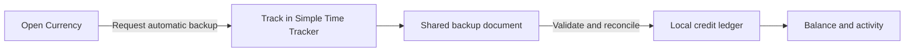

<p align="center">
  
</p>
<h1 align="center">Currency</h1>
<p align="center"><strong>Work earns. Leisure spends. Keep tracking where you already do.</strong></p>
<p align="center">
  <a href="https://github.com/Flecart/currency/actions/workflows/android.yml"></a>
  
  
</p>

Currency is an experimental Android companion for [Simple Time Tracker](https://github.com/Razeeman/Android-SimpleTimeTracker). It turns completed work sessions into credits and charges credits for leisure, using the records you already track in STT.

Open Currency to see your balance, recent activity, and how much work would bring a deficit back to zero. **No second timer, account, or daily data entry.**

## What it does

| View | What you see |
| --- | --- |
| **Today** | Balance, work and leisure totals, weekly summary, and the current exchange rate |
| **Activity** | Recent completed earning and spending sessions |
| **Archived** | Activities archived in STT and their recent sessions, kept out of the main lists |
| **Rules** | Earning rates, activity mappings, and the trial's calibration |

- Reads an STT backup on opening and once per minute while visible.
- Reconciles corrections and deletions without counting imports twice.
- Keeps your trial and document connection across app updates.
- Stores data locally, with no internet permission, analytics, cloud backup, or background service.

This is a personal experiment with fixed activity mappings, not a general-purpose habit coach. The current version is **0.2.0**. See the [changelog](CHANGELOG.md).

## Get started

You'll need **Android 8.0+** and **Simple Time Tracker**. The integration has been tested against STT **1.59**.

1. [Build and install Currency](#build-and-install).
2. In STT settings, enable **Automatic backup** and choose a local backup document that includes records.
3. Open Currency, tap **Choose backup & start trial**, and select **that same document**. Use an STT backup, not a CSV export.
4. Continue tracking in STT. Stop or switch a timer before expecting that session to affect Currency.

The first successful import starts your balance at **zero**. Earlier records only calibrate the leisure price. If file access changes, use **Reconnect** with the same STT dataset.

## The economy

| Activity | Rate |
| --- | --- |
| Main work | **50 minutes → 1 C** |
| `esplorazioni` and `sides` | **200 minutes → 1 C** (25% of main work) |
| `svago` | Spends credits at the trial's calibrated rate |
| Other activities | Neutral unless mapped to work |

Main work includes activities in STT's `Work` category and the named projects `thesis`, `oxford`, `zhijing`, and `aria`. Names are case-insensitive. `Pausa` tags suppress work earnings; all `svago` still costs.

The leisure price uses the preceding 28 days so that replaying the baseline would spend 105% of its earnings. It stays fixed during the 14-day trial and continues afterward. Negative balances are allowed; there are no penalties, caps, decay, streak resets, or neglect bonuses.

See [economy rules](docs/economy.md) for overlap handling, fallback prices, and upgrade behavior.

## Build and install

Requirements: **a full JDK 21**, **Android SDK platform 36**, and network access for the first dependency download. Set `JAVA_HOME` and `ANDROID_HOME`, or configure `sdk.dir` in a local `local.properties` file.

```sh
git clone https://github.com/Flecart/currency.git
cd currency
./gradlew :core:test :app:assembleDebug
```

Connect a phone with USB debugging enabled and accept its debugging prompt:

```sh
./install-debug.sh              # Build, update, and open the app
./install-debug.sh --no-build   # Install the existing APK quickly
./install-debug.sh --wait       # Wait for a USB phone before building
```

Use `--serial SERIAL` to select a particular device. Updates preserve app data. The script supports Linux SDK locations and asdf JDK installations; use `--help` for all options.

The debug APK is generated at `app/build/outputs/apk/debug/app-debug.apk`. APKs and signing keys are not committed. Keep the same local debug signing key when building updates for an existing installation.

## How the connection works



**Completed sessions only.** STT's backup route does not expose active timers or acknowledge successful writes. Currency shows when it read the file; it cannot guarantee that STT has just updated it. Failed reads retain the last accepted balance.

[Integration details](docs/integration.md) explain document permissions, snapshot validation, and compatibility limits.

## Development

The project uses Kotlin, Jetpack Compose, Room, and a separate JVM accounting module.

```sh
./gradlew :core:test :app:assembleDebug :app:assembleDebugAndroidTest :app:lintDebug
# With a disposable emulator connected:
./gradlew :app:connectedDebugAndroidTest
```

CI runs the core tests, builds both APKs, and checks Android lint. Device tests run separately. See [validation](VALIDATION.md), [contributing](CONTRIBUTING.md), and [third-party notices](THIRD_PARTY_NOTICES.md).

A project license has not been selected yet.
